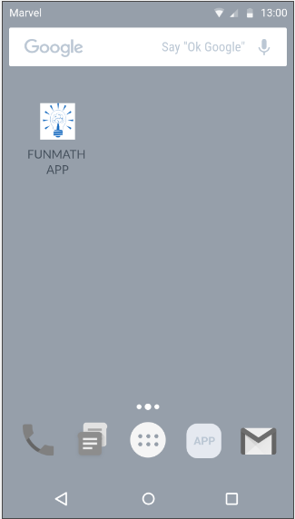
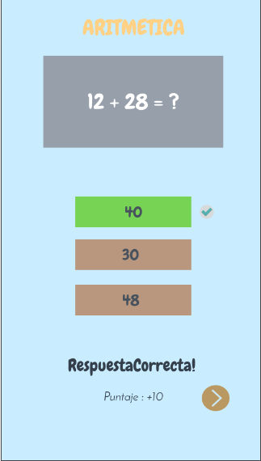
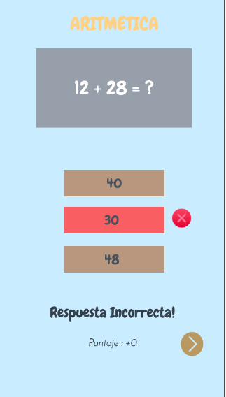
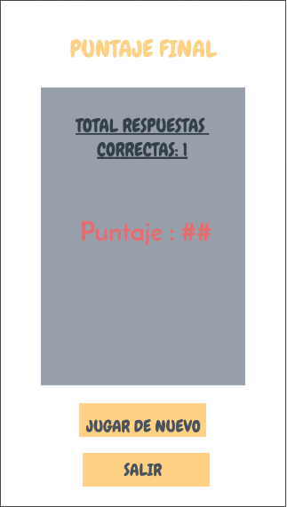

# Diseño de interfaz de usuario

La interfaz de usuario de la aplicación FUNMATH esta inspirada en la interfaz de usuari de
aplicaicones similares 

El diseño completo esta disponible
en: https://marvelapp.com/prototype/81jgj2e

. Los colores a usar estar[an basados en una combinación agradable a la vista. A continuación se
presentan las principales pantallas:

1. Logo para ingresar al app

   Logo del app

   

2. Menú Principal

   Al seleccionar un modo de juego, el usuario verá la lista de preguntas y prodra seleccionar las respuestas

   
   
   

3. Final del juego

   Al finalizar todas las preguntas se mostrará el puntaje final y la cantidad de respuestas acertadas

   
